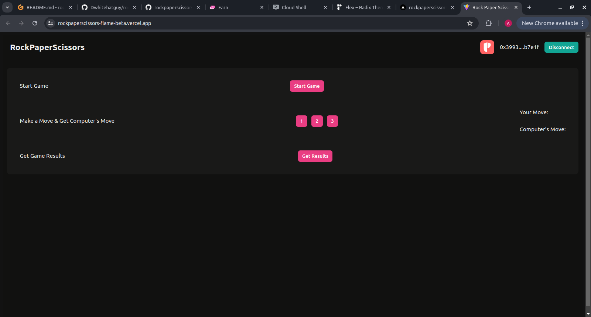

# RockPaperScissors

RockPaperScissors is a user interface for the Aptos RockPaperScissors Game smart contract.

[Demo app](https://rockpaperscissors-flame-beta.vercel.app/)

[Video](https://www.loom.com/share/cb17d50a430543e8a41467321d2c63d6?sid=b21169cf-07c5-49cf-8110-a0a1a93eca25)

[Smart Contract](https://aptoscan.com/account/0x7ceb17f0ef05939768914cf7fb5aaeb4f3b14916f388a4e103a1090a487e1fc2?network=testnet)

## Setup

1. Clone repo and change directory:
```bash
  git clone https://github.com/dwhitehatguy/rockpaperscissors ; cd rockpaperscissors
```
2. Install depedencies and run app:
```bash
  npm install ; npm run dev
```

## Demo




Thanks.
