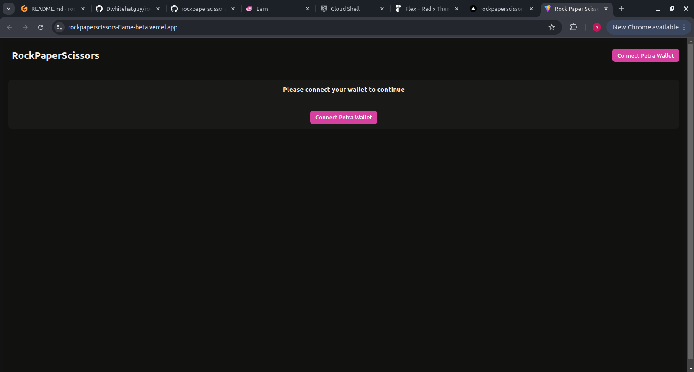

# RockPaperScissors

[Live app](https://baloswap.vercel.app)

[Video Demo](https://www.loom.com/share/184f813850b44eb3a6d30b8d98a4d711?sid=6d502d22-1d82-4a49-a1d3-f69bb092b0f2)

[Smart Contract](https://aptoscan.com/account/0x7ceb17f0ef05939768914cf7fb5aaeb4f3b14916f388a4e103a1090a487e1fc2?network=testnet)

RockPaperScissors is a user interface for the Aptos RockPaperScissors Game smart contract.

## Setup

1. Clone repo and change directory:
```bash
  git clone https://github.com/balojey/rockpaperscissors ; cd rockpaperscissors
```
2. Install depedencies and run app:
```bash
  npm install ; npm run dev
```

## Demo




Thanks.
